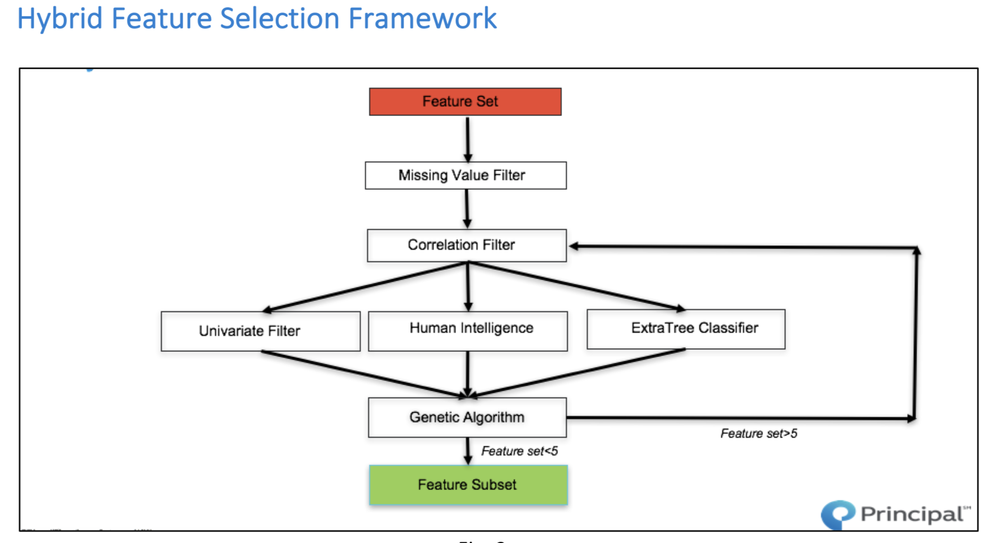

# PrincipalFinance-UniverseModelling
The market for AI in financial services is expected to grow from 1.3 billion in 2017 to 7.4 billion in 2022, at a CAGR of 40.4%, according to Research and Markets which means that this domain is very rich to obtain constructive results which can help in improving revenues in stocks sector by introducing automated models. Final goal of this project was to build a model which could predict excess return based on sector neutral approach.

This document is for Universe Modeling project sponsored by Principal Finance Group. 

All of notebooks uses Python 3.5

------- PreProcessing---------

Asset_Clusterization: This script is initial exploration of problem. Various dimensionality reduction techniques like PCA, t-SNE are being used. Also, k-means clustering has been implemented.

Corr_principle: This script has correlation analysis with different thresholds.

Data_Preprocessing: This script deals with data preprocessing. 

---------- Genetic Algorithm---------

GA_without_tpot_100_100: Genetic Algorithm

------- Regression--------------

Principal-Finance-Feature Lag-New: This script went wrong because we lagged target variable but important takeaway is future prices are one of most important indicator.

Principal_Modelling-OriginalFeatures: This script is based on 18 features with different modeling techniques

Principal_Modelling-DerivedFeatures: This is all with time variant features.

Principal_Latest: This is the final script with different experiments. Also, includes model investigation.

